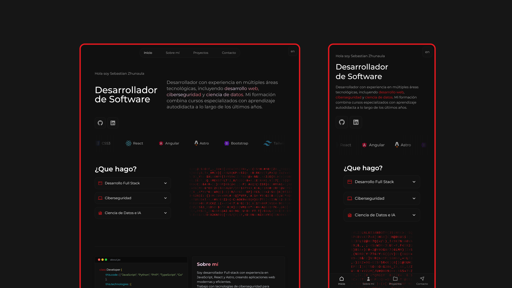

# Portfolio: Sebastian Zhunaula | Full Stack Architect

<p align="center">
  
</p>

Minimalist and premium portfolio built with **Astro**, **Tailwind CSS**, and **Alpine.js**, featuring full multi-language support and a high-performance terminal aesthetic.

## 🚀 Key Project Structure

```text
/
├── public/                 # Static assets (Favicon, PDFs, etc.)
│   └── Img/                # Project mockups and branding images
├── src/
│   ├── components/         # UI Components (Multi-language support)
│   │   ├── en/             # English Translated Components
│   │   │   ├── About.astro
│   │   │   └── ...
│   │   ├── About.astro     # Spanish Components (Default)
│   │   └── ...
│   ├── fonts/              # Local Fonts (Aldrich & Roboto Condensed)
│   │   ├── Aldrich-Regular.ttf
│   │   └── RobotoCondensed-Regular.ttf
│   ├── layouts/
│   │   └── Layout.astro    # Base template with dynamic meta tags
│   ├── pages/
│   │   ├── index.astro     # Spanish Landing Page (Home)
│   │   ├── en.astro        # English Landing Page (/en)
│   │   └── og.png.ts       # Dynamic OG Image Generator Endpoint
│   └── styles/
│       └── global.css      # Custom Tailwind utilities & animations
├── package.json            # Dependencies (Tailwind v4, Alpine.js, Satori)
└── astro.config.mjs        # Astro configuration
```

## 🛠️ Main Tech Stack

*   **Framework**: [Astro 5](https://astro.build/) (Static Site Generation)
*   **Styling**: [Tailwind CSS v4](https://tailwindcss.com/)
*   **Interactivity**: [Alpine.js](https://alpinejs.dev/) (Mobile Menu & AJAX)
*   **Typography**: Aldrich & Roboto Condensed (Modern high-tech pairing)
*   **Backend**: [Formspree](https://formspree.io/) (Functional Contact Form)
*   **OG Generation**: [Satori](https://github.com/vercel/satori) & [Resvg](https://github.com/yisibl/resvg-js) (Dynamic Social Images)

## 🧞 Commands

All commands are run from the root of the project:

| Command | Action |
| :--- | :--- |
| `npm install` | Installs dependencies |
| `npm run dev` | Starts local dev server at `localhost:4321` |
| `npm run build` | Build your production site to `./dist/` |
| `npm run preview` | Preview your build locally before deploying |

## ✨ Features

- **Multi-language**: Seamless switching between Spanish and English.
- **Functional Contact Form**: Integrated with Formspree and handled via AJAX for a smooth user experience (no page reloads).
- **Dynamic OG Images**: Programmatically generated social media preview images (`/og.png`) that perfectly match the site's cyberpunk aesthetic using Satori.
- **Refined Branding**: Custom `favicon.png` logo with dynamic green glow and synchronized borders.
- **Premium UX**: Smooth animations, continuous tech ticker, and language-specific CVs that open in new tabs.
- **Modern Typography**: Carefully selected font pairing (Aldrich/Roboto Condensed) for a futuristic aesthetic.
- **Mobile Optimized**: Custom full-screen mobile menu with smooth transitions and centered layout.
- **Terminal UI**: Custom ASCII art and syntax-highlighted system info for a developer-centric feel.
